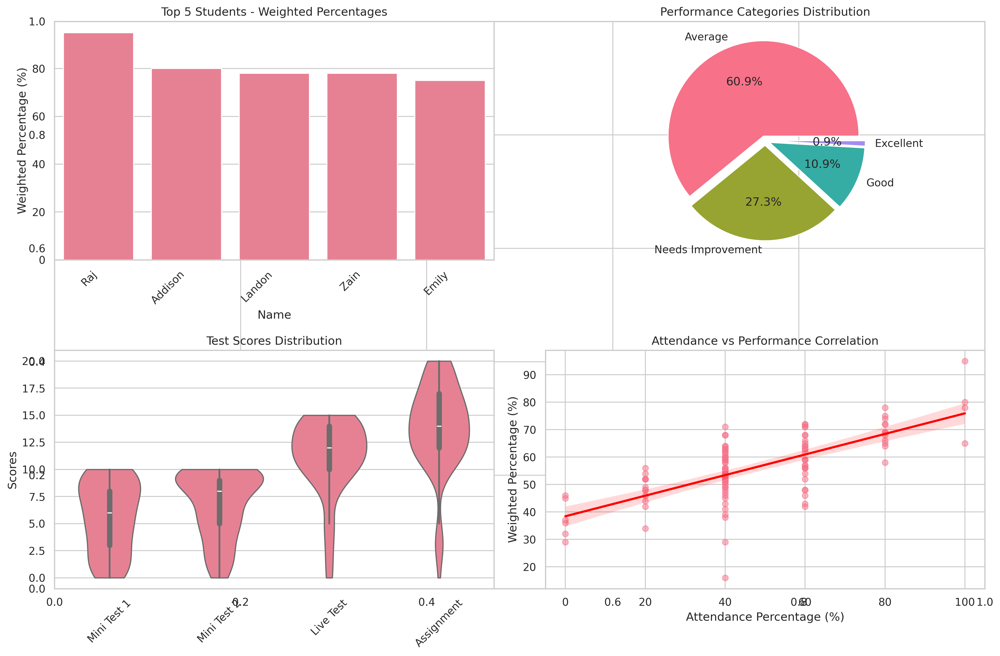
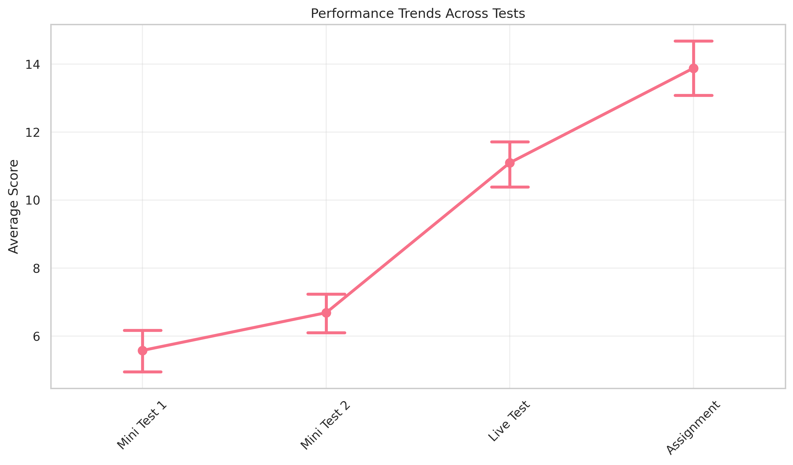
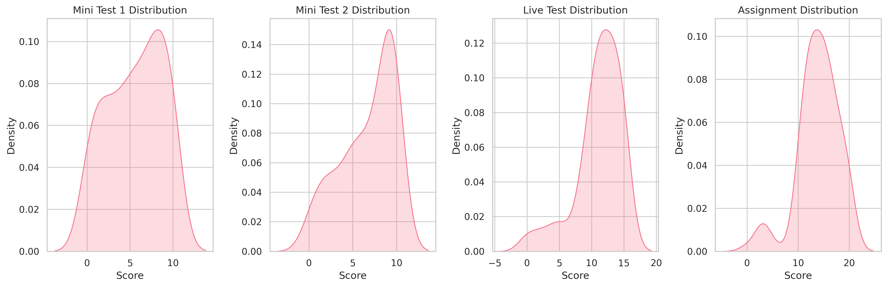
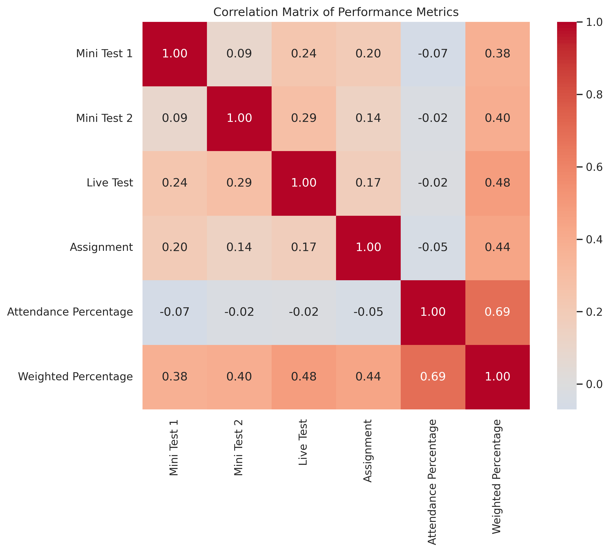
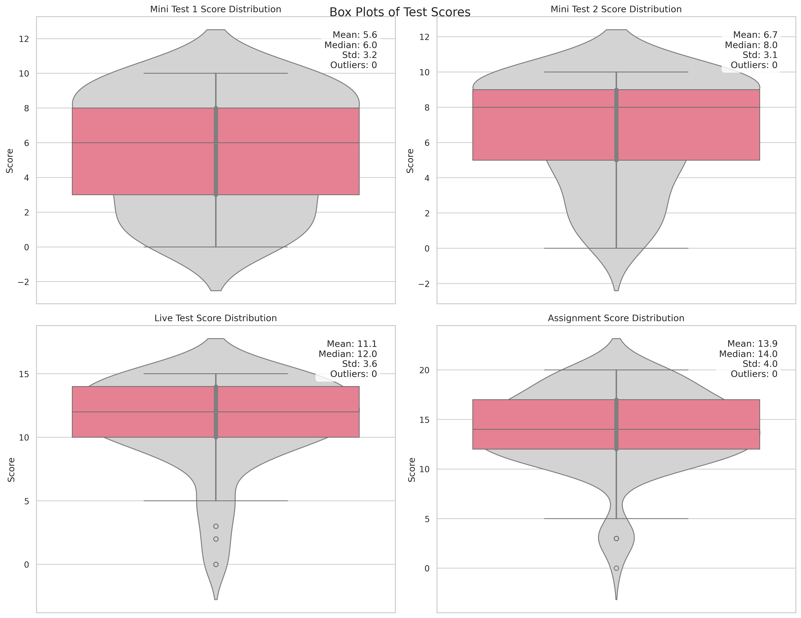
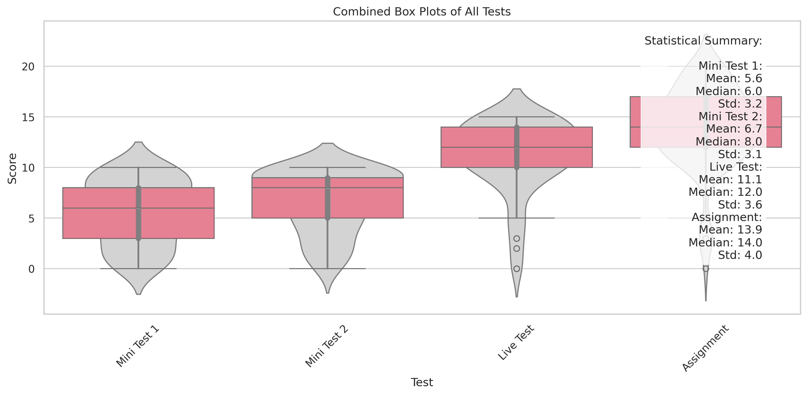

# Student Performance Analysis Report

## Overview
This report presents a comprehensive analysis of student performance based on various assessment components including Mini Tests, Live Tests, and Assignments, along with attendance data. The analysis includes statistical measures, performance categorization, and visual representations of the data.

## Assessment Components
The assessment structure consists of the following components:
- Mini Test 1 (20% of total marks)
- Mini Test 2 (20% of total marks)
- Live Test (40% of total marks)
- Assignment (20% of total marks)

## Performance Categories
Students are classified into the following performance categories:
- Excellent: ≥ 85%
- Good: ≥ 71%
- Average: ≥ 50%
- Needs Improvement: < 50%

## Analysis Results

### 1. Performance Distribution

The pie chart above shows the distribution of students across different performance categories. This visualization helps identify the overall performance landscape of the class.

### 2. Top Performers
The analysis identified the top 3 performing students based on weighted percentage, taking into account both academic performance and attendance.

### 3. Performance Trends

This visualization shows the progression of student performance across different assessment components, helping identify patterns and areas of improvement.

### 4. Score Distributions

The distribution plots for each assessment component provide insights into the spread and shape of scores across different tests and assignments.

### 5. Correlation Analysis

The correlation matrix reveals relationships between different performance metrics, including:
- Correlation between attendance and overall performance
- Relationships between different assessment components
- Impact of attendance on final scores

### 6. Box Plot Analysis

The box plots provide detailed statistical information about score distributions, including:
- Median scores
- Score ranges
- Outlier identification
- Score spread across different assessment components

### 7. Combined Analysis

This visualization provides a comprehensive view of all assessment components in a single plot, facilitating easy comparison between different tests and assignments.

## Key Findings

1. **Performance Distribution**
   - Distribution of students across performance categories
   - Percentage of students in each category

2. **Attendance Impact**
   - Correlation between attendance and performance
   - Statistical significance of attendance on performance

3. **Assessment Component Analysis**
   - Performance trends across different tests
   - Score distributions and patterns
   - Identification of challenging areas

4. **Statistical Measures**
   - Mean, median, and standard deviation for each component
   - Outlier analysis and identification
   - Performance consistency measures

## Recommendations

1. **For Students**
   - Focus on maintaining consistent attendance
   - Pay attention to areas showing lower performance
   - Utilize feedback from previous assessments

2. **For Educators**
   - Identify students needing additional support
   - Monitor attendance patterns
   - Adjust teaching strategies based on performance patterns

3. **For Course Improvement**
   - Review assessment difficulty levels
   - Consider attendance policies
   - Implement targeted support programs

## Detailed Results
For detailed numerical results and additional analysis, please refer to the Excel file 'student_analysis_results.xlsx' which contains:
- Complete dataset
- Statistical summaries
- Performance category breakdowns
- Attendance analysis
- Correlation matrices

## Conclusion
This analysis provides valuable insights into student performance patterns, helping identify areas for improvement and success factors. The combination of academic performance and attendance data offers a comprehensive view of student achievement and engagement. 